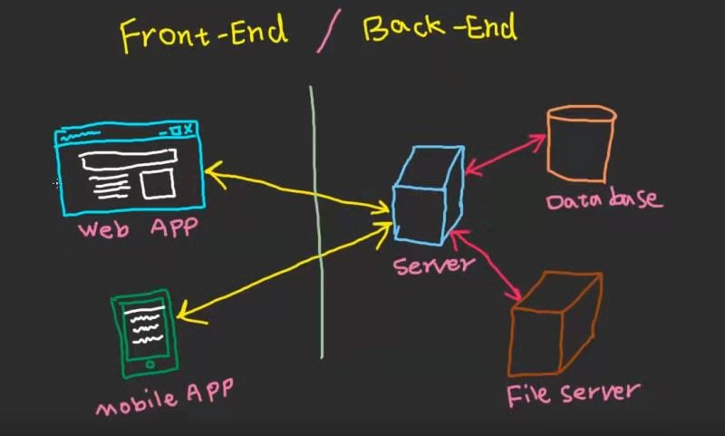

# D2D 集训营第5期

前面我们已经学会在页面使用 js 的基础语法遍历数据并往页面插入 html，这时候数据是写死的，如果数据是从服务器动态加载的呢？本次培训就围绕 ajax 技术和 web 应用架构来展开。

日期：2019/06/25

地点：WeaTech 526 小会议室

## 🥇 培训大纲

- 工程师解决问题的思路
  - 发现问题
  - 定位问题
  - 个性问题转化成共性问题
  - 搜索引擎全网查询
- Web 应用系统架构概览
  - 客户端
  - 服务器
  - Http 请求
- 浏览器中使用 Ajax 发起请求
  - `$.get()` 发起请求加载本地静态数据
  - `$().load()` 发起请求加载 html 片段
  - `$.get()` 发起请求加载其他服务器上动态数据

## 📚 培训内容

本次课程主要围绕 Web 应用的基本架构，帮助大家认清整个 Web 系统的基本模样，以及自身所处的位置。

### 1）Web 前端架构演变史

当我们在浏览器中输入 `https://www.weaver.com.cn/` 时发生了什么？

**传统架构**


服务端通过 php、jsp、asp 等模板技术，在服务器中渲染出浏览器能运行的纯 `html`，发送至浏览器。

``` php
<html>
  <head><title>Car {{ $car->id }}</title></head>
  <body>
    <h1>Car {{ $car->id }}</h1>
    <ul>
      <li>Make: {{ $car->make }}</li>
      <li>Model: {{ $car->model }}</li>
      <li>Produced on: {{ $car->produced_on }}</li>
    </ul>
  </body>
</html>
```

**单页应用架构**


服务端不再负责渲染页面，而是通过 `Ajax` 技术向页面发送数据，客户端的 `js` 将数据动态渲染至 `html`.

```js
var renderCard = function(datas) {
  var templete = '';
  for(var i =0; i<datas.length; i++) {
    var tag = '' 
    + '<div class="col-xl-3 col-md-6 mb-4">'
    +   '<div class="card border-0 shadow showcase-img">'
    +     ''
    +     '<div class="card-body text-center">'
    +       '<h5 class="card-title mb-0">'+ datas[i].name +'</h5>'
    +       '<div class="card-text text-black-50">'+ datas[i].role +'</div>'
    +     '</div>'
    +   '</div>'
    + '</div>';
    templete = templete + tag;
  }
  document.getElementById('wued_cards').innerHTML = templete;
}
$.get('/api/wued', function(res) {
  renderCard(res);
})
```

### 2）Web 应用架构图

现场使用 Adobe XD 绘制架构图，方便学员理解整体网络运行架构：



### 3）Ajax 技术

[Ajax](https://developer.mozilla.org/en-US/docs/Web/Guide/AJAX) 是世界上最流行的页面动态加载技术，请查阅使用文档 [Jquery 函数字典 Ajax 篇](http://jquery.cuishifeng.cn/jQuery.get.html)


### 用例一

发起 `ajax` 请求给本地服务器，加载人员卡片的静态 `json` 数据

``` js
// 发起 ajax 请求给本地服务器，加载人员卡片的静态数据
$.get('./wued.json', function(res) {
  renderCard(res);
})
```

### 用例二

发起 `ajax` 请求给本地服务器，加载公共页面 HTML 片段

``` js
// 发起 ajax 请求给本地服务器，加载公共页面 HTML 片段
$('#wued_footer').load("./footer.html", function() {
  console.log('footer 加载完成');
})
```

## ✏️ 课后作业

本次课程内容较多，暂无课后作业，等待下期布置。

## 💯 练习资料

请参考 `wued-code-camp\examples\AJAX`，`compelete` 为参考答案，`initial` 中可以自行对照练习。

## 📑 参考资料

[1] [浏览器的同源策略.MDN Web Docs](https://developer.mozilla.org/zh-CN/docs/Web/Security/Same-origin_policy)

[2] [Jquery 函数字典 Ajax 篇](http://jquery.cuishifeng.cn/jQuery.get.html)

[3] [Asynchronous JavaScript + XML](https://developer.mozilla.org/en-US/docs/Web/Guide/AJAX)